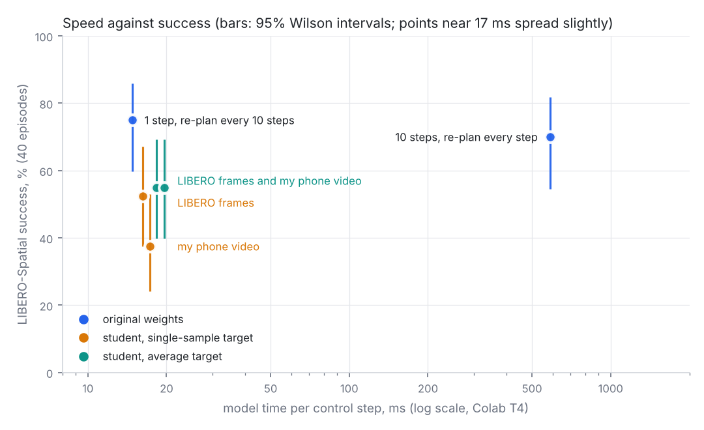
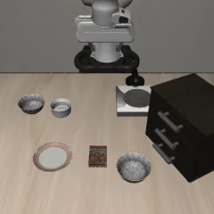
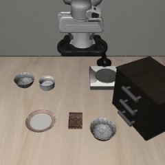
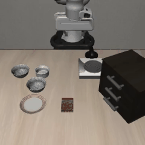
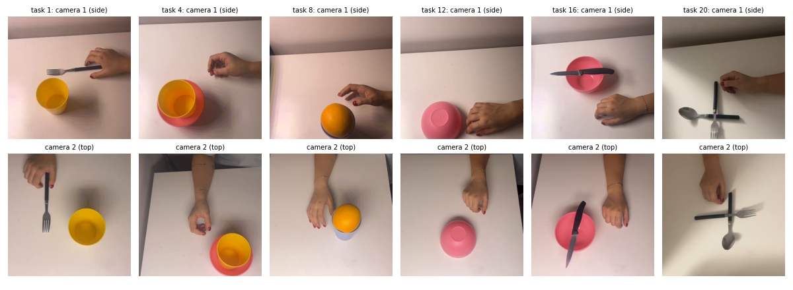

# A fast SmolVLA on a T4, and what my phone video taught me about distilling it

SmolVLA (`HuggingFaceVLA/smolvla_libero`) on LIBERO-Spatial, Franka Panda arm, one Colab T4.

- **Speed, no training:** model time per control step from **842 ms to 17 ms**, with no loss of success visible over
  40 episodes (75% vs 70% for the 10-step reference).
- **My data:** I recorded 20 manipulation tasks with my phone and used them, without action labels, to distil the
  10-step action sampler into a 1-step student. The student got closer to the teacher offline and **worse in
  simulation**. A control run on simulator frames and one extra measurement show why: one denoising step already
  returns a stable average action, and distillation replaced it with a noisy imitation of the teacher's samples.

| configuration (float16 vision-language model) | model ms per call | model ms per control step | success (40 episodes) | 95% interval |
|---|---|---|---|---|
| 10 denoising steps, re-plan every step | 586 | 586 | 28/40 (70%) | 55 to 82% |
| **1 step, re-plan every 10 steps** | 172 | **17** | **30/40 (75%)** | 60 to 86% |
| student distilled on LIBERO frames | 174 | 17 | 21/40 (52.5%) | 37 to 67% |
| student distilled on my phone video | 173 | 17 | 15/40 (37.5%) | 24 to 53% |

The checkpoint as shipped (bfloat16, 10 steps, re-plan every step) takes 842 ms per call on the same GPU.
Times are medians measured inside the LIBERO runs, which happened on different Colab machines. Re-measured in a
single session on random inputs: 854 ms as shipped, 704 ms in float16 with 10 steps, and 153 to 193 ms with 1 step
(two measurements of the same computation, so roughly 20% is machine noise), which is 15 to 19 ms per control step.

| 1 step, re-plan every 10 steps | 10 steps, re-plan every step | student distilled on my phone video |
|---|---|---|
|  |  |  |

## 1. Making it fast

I timed the model first. A LIBERO step took 1.3 s; about 0.5 s of that is the simulator, the rest is the model.
Inside one model call (random inputs, T4):

| stage | bfloat16 (as shipped) | float16 |
|---|---|---|
| vision encoder, 2 images | 213 ms | 26 ms |
| prefix pass (images, text, state) | 76 ms | 69 ms |
| flow-matching loop, 10 steps | 639 ms | 640 ms |

Three changes, none of which needs training:

1. **float16 instead of bfloat16.** The T4 has no fast bfloat16 path. The vision encoder became 8x faster, and the
   output moved *closer* to full precision (relative error 0.0025 against 0.031).
2. **1 denoising step instead of 10.** Each step costs about 60 ms.
3. **Re-plan every 10 control steps instead of every step.** The model predicts 50 actions per call; the checkpoint
   executes one and throws away 49.

## 2. Using my phone video

**Data.** 20 one-handed tasks with household objects (cup, bowl, fork, knife, banana, orange), each filmed from
above and from the side. 24 time-matched frames per clip, 480 frame pairs. The side view plays LIBERO's front camera
and the top view its wrist camera. Instructions are in [`data/tasks.txt`](data/tasks.txt).

**Idea.** Phone video has no action labels, which usually makes it hard to use for a policy. Step distillation does
not need labels: the 10-step model is the teacher, its answer on my frames is the target, and a copy of the action
expert learns to give that answer in one step from the same starting noise. If it worked, the 1-step model would be
both fast and as good as the 10-step one.

**Result.** On held-out phone tasks the student's distance to the teacher halved (0.67 to 0.35). In LIBERO it
dropped from 75% to 37.5%.

**Control.** I captured the model's inputs during the fast evaluation (593 LIBERO frames with real robot state) and
trained the same student on them. It also got closer to the teacher (0.49 to 0.28) and also got worse in LIBERO
(52.5%), even though it was evaluated on the scenes it was trained on. So the method was the main problem, and the
domain gap of the phone video made it worse.

**Why.** For flow matching, one Euler step from noise returns roughly the mean action for the observation, which
hardly depends on the noise. Ten steps return a sample, which does. I fed each model the same input with 6
different starting noises and measured how much the answers differ (0 = identical):

| model | LIBERO frames | phone frames |
|---|---|---|
| original, 1 step | 0.15 | 0.20 |
| student (LIBERO frames), 1 step | 0.54 | 0.54 |
| student (phone video), 1 step | 0.58 | 0.64 |
| teacher, 10 steps | 0.59 | 0.68 |

The students became as noise-dependent as the teacher while still being far from it: they lost the stable mean and
did not gain an accurate sample. That matches the videos I watched: the students reach the bowl, then hesitate and
jitter at the grasp. The teacher is just as noise-dependent and still succeeds, so this number alone does not predict failure.

The phone frames gave the same diagnosis as the LIBERO frames, in the same order and at similar values.

## What worked and what did not

Worked:
- Measuring before optimising. The bfloat16 problem only showed up because I timed each stage.
- The control run. Without it I would have blamed the phone video.

Did not work:
- Distilling onto my phone video, and distilling at all with this recipe.
- My choice of objects. I filmed forks, bananas and knives on a white table, while every
  LIBERO-Spatial task is "put the black bowl on the plate" on a wooden table. The phone
  student trained on scenes it would never see, which probably explains part of why it
  scored below the student trained on LIBERO frames (37.5% vs 52.5%). Next time I would
  film the LIBERO task itself: a dark bowl, a white plate, the same camera angles.
- Distance to the teacher as an offline metric. It ranked the students above the original model; LIBERO ranked
  them below.
- Ten-episode evaluations. They gave 10/10 for the fast setting and 2/10 for the phone student; 40 episodes gave
  75% and 37.5%. The first initial state of each task is easy. Those runs are in [`results/early`](results/early).
- Several of my own predictions: that the model was 95% of step time (it is 57%), and that the student
  would help when executing 10 actions at once (it got worse).

## Design choices

- **SmolVLA on LIBERO-Spatial,** the setting from the challenge, small enough for a T4.
- **Measure inside the simulator.** `fast_eval.py` times every model call during evaluation, because numbers from
  an isolated benchmark did not match the ones inside the loop.
- **Report model time, not wall-clock time.** About 0.5 s per step is LIBERO physics and rendering, which a real
  robot does not have.
- **Train only the action expert.** The time is spent there; vision and language stay frozen.
- **Hold out tasks.** Phone tasks 17 to 20 and LIBERO tasks 8 and 9 are never trained on.
- **40 episodes and Wilson intervals** for every success rate that is compared.

## Limitations

- One task suite (LIBERO-Spatial, which is always "put the bowl on the plate"), one GPU type, 40 episodes per
  configuration. Differences under about 20 points are within noise.
- The LIBERO student was evaluated on the initial states it was trained on, which favours it; it still lost.
- Robot state for the phone frames is set to the dataset mean.
- Timings vary by about 10% between Colab T4 machines.

## Run it

Open [`notebook.ipynb`](notebook.ipynb) in Colab with a T4. Sections 1 and 5 take minutes; each LIBERO evaluation
takes 1 to 2 hours and each student about 15 minutes to train. Student weights (about 400 MB each) are not in the
repository; the notebook rebuilds them.

| file | content |
|---|---|
| `notebook.ipynb` | everything, in order, with my results under each step |
| `fast_eval.py` | `lerobot-eval` with float16, student weights, input capture and timing |
| `distill.py` | datasets, teacher targets, student training, offline measurements |
| `plot_results.py` | table and figure from `results/` |
| `results/` | evaluation outputs (`*.json`), model timings, table, figure |
| `data/` | task list and my frames (`phone_frames.zip`, 480 pairs at 256 px) |
